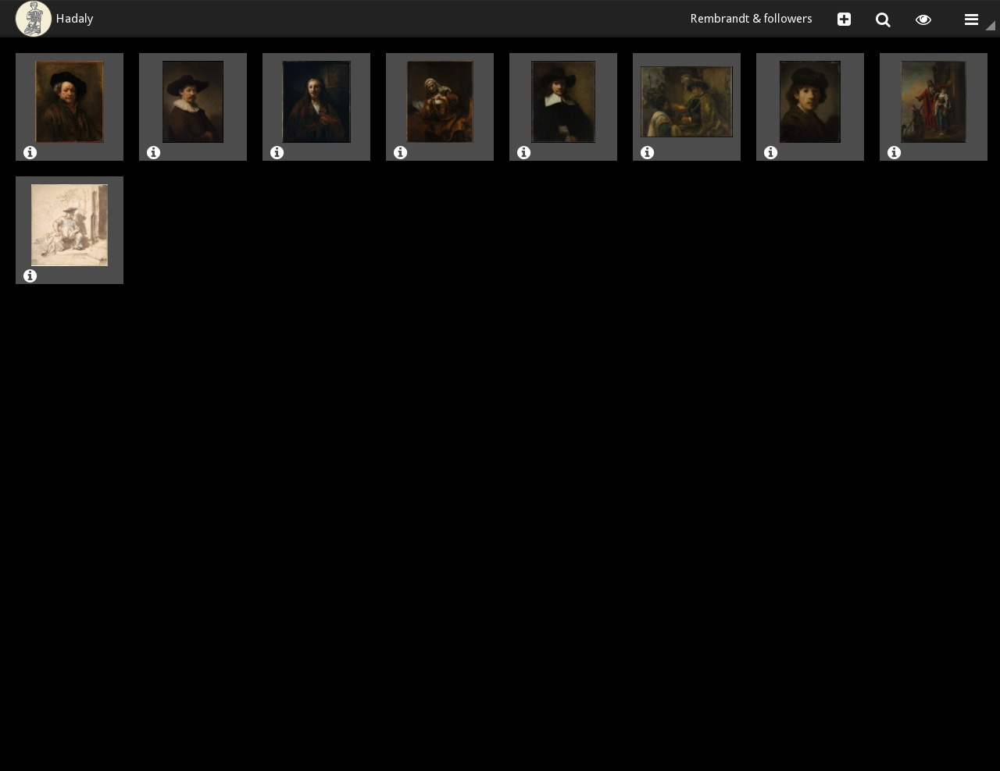

.. Hadaly documentation master file, created by
   sphinx-quickstart on Thu Jun 19 03:14:20 2014.
   You can adapt this file completely to your liking, but it should at least
   contain the root `toctree` directive.

Hadaly User Manual
==================

.. warning:: This sofware is currently in alpha.

Hadaly is an interactive presentation software. It allows to manipulate slides in
various ways during presentation. The goal is to offer a practical
presentation software for art historians or any art enthusiasts.

It contains an editor, viewer and a search engine. The editor allows you to
build presentations by creating slides which are a combination of an image and informations (e.g: artist, title and year). The
viewer allows you to show and manipulate the slides. The search engine allows you create slides from different online sources.

Presentations are saved as \*.opah files which contains all the slides image files and their metadata (JSON).

Table of Content
================

.. toctree::
   :maxdepth: 2

   installation
   usage
   interface